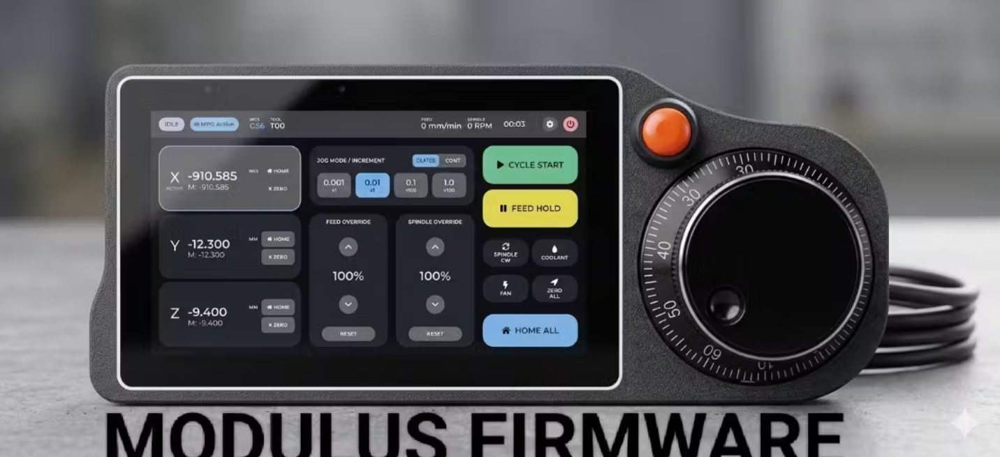

<p align="center">
  
</p>

<p align="center">
  <a href="README.md">English</a> · <strong>Deutsch</strong>
</p>

# Modulus Firmware – C6-OTA für Tab5

**Version:** 3.1.0  
**Autor:** D. McLean / BufferRoot  
**Feature-Branch:** `feature/tab5-c6-ota`  
**Plattform:** M5Stack Tab5 (ESP32-P4 + ESP32-C6)  
**Lizenz:** [MIT](LICENSE)

Modulus ist eine CNC-Pendant-Firmware für das M5Stack Tab5. Der ESP32-P4 führt
Oberfläche und Steuerungslogik aus; der ESP32-C6 stellt WLAN, BLE und ESP-NOW
über ESP-Hosted/SDIO bereit. Das Pendant ersetzt nicht die Maschinensteuerung
und nicht den hardwareseitigen Not-Aus.

## Warum es diesen Feature-Branch gibt

Für ein C6-Update war bisher eine separate USB-/Bootloader-Verbindung zum C6
nötig. Dieser Branch ergänzt im P4-Menü die Seite **C6 Update**. Damit lässt sich
eine kompatible C6-Anwendungsdatei von der SD-Karte auswählen und über die
bereits vorhandene ESP-Hosted-SDIO-Verbindung übertragen.

Der vorgesehene Ablauf lautet deshalb **zuerst P4, danach C6**: Zunächst wird
die P4-Firmware mit dem neuen Updater installiert. Anschließend startet Modulus
normal und aktualisiert den C6 über **M Panel → C6 Update**. Das Flashen beginnt
niemals automatisch. Image-Prüfung, ausdrückliche Bestätigung, Fortschrittsbalken
und Neustart-Schaltfläche sichern den Ablauf ab.

## Architektur in Kurzform

| Ziel | Aufgabe |
|------|---------|
| **ESP32-P4** | Tab5-Oberfläche, MPG und Steuerung; enthält den C6-Updater |
| **ESP32-C6** | WLAN, BLE und ESP-NOW über ESP-Hosted/SDIO |
| **ESP32-S3** | ESP-NOW-Bridge im Schaltschrank zur CNC-UART |
| **NanoH2** | Optionaler Zigbee-Koordinator |

## Voraussetzungen

- ESP-IDF 6.0.1 und esptool
- USB-Verbindung zum Tab5-P4 (Beispiel: `COM5`)
- FAT32-formatierte SD-Karte für das C6-Update
- Passende Builds desselben Firmwarestands für P4 und C6

Die COM-Portnummer kann auf deinem Rechner abweichen.

## Empfohlene Flash-Reihenfolge

### 1. ESP32-P4 zuerst flashen

Dieser Feature-Branch muss auf dem P4 laufen, bevor der C6 per SDIO aktualisiert
werden kann. Baue ihn mit:

```powershell
.\scripts\build_tab5.ps1
```

> [!IMPORTANT]
> Für den Tab5-P4 immer das Build-Skript verwenden. Ein direktes
> `idf.py build` wendet die nötigen ESP-IDF-6-/ESP-Hosted-Patches nicht an.

Flashe danach den vollständigen P4-Satz aus dem erzeugten Paket:

```powershell
cd path\to\tab5-p4
esptool.py --chip esp32p4 -p COM5 --before default-reset --after hard-reset write_flash `
  --flash-mode dio --flash-freq 40m --flash-size 16MB `
  0x2000 bootloader.bin `
  0x8000 partition-table.bin `
  0x10000 modulus_tab5.bin
```

Tab5 vollständig aus- und wieder einschalten. Warte auf das normale Dashboard
und prüfe, ob **M Panel → C6 Update** vorhanden ist.

### 2. C6-Anwendungsdatei erzeugen

Baue die C6-Firmware mit:

```powershell
.\scripts\build_tab5_c6_modulus.ps1
```

Die für OTA benötigte Datei ist:

```text
firmware/tab5-c6/build/network_adapter.bin
```

Sie darf umbenannt werden, zum Beispiel in
`modulus-c6-ota-2.12.12.bin`. Entscheidend ist ihr Inhalt, nicht der Dateiname.

### 3. ESP32-C6 über das Tab5 aktualisieren

1. SD-Karte als FAT32 formatieren.
2. **Nur** `network_adapter.bin` beziehungsweise die umbenannte OTA-Datei in
   das Stammverzeichnis der SD-Karte kopieren.
3. SD-Karte in das laufende Tab5 einsetzen.
4. **M Panel → C6 Update** öffnen.
5. **Refresh SD** drücken, Datei auswählen und **Check image** drücken.
6. Prüfen, dass ein ESP32-C6-Application-Image erkannt und akzeptiert wird.
7. **Flash C6** drücken und die Sicherheitsabfrage bestätigen.
8. Während des Fortschrittsbalkens weder Strom noch SD-Karte entfernen.
9. Nach erfolgreicher Aktivierung **Restart Modulus** drücken.
10. Prüfen, ob Dashboard und C6-/ESP-NOW-Verbindung wieder verfügbar sind.

> [!WARNING]
> Kein Full-/Merged-Image, Release-ZIP, `bootloader.bin`,
> `partition-table.bin` oder `ota_data_initial.bin` im OTA-Menü auswählen.
> Diese Dateien sind für feste Flash-Adressen bestimmt und keine gültigen
> OTA-Anwendungsimages.

## C6-Wiederherstellung per USB

Dieser Weg ist nur nötig, wenn der C6 nicht mehr weit genug startet, um
ESP-Hosted/SDIO-OTA anzubieten. Verbinde den C6-Bootloader per USB und flashe
den vollständigen Satz an seine festen Adressen:

```powershell
cd path\to\tab5-c6
esptool.py --chip esp32c6 -p COM6 --before default-reset --after hard-reset write_flash `
  --flash-mode dio --flash-freq 80m --flash-size 4MB `
  0x0 bootloader.bin `
  0x8000 partition-table.bin `
  0xd000 ota_data_initial.bin `
  0x10000 network_adapter.bin
```

Falls kein Port erscheint, beim Anschließen des C6-USB die **BOOT**-Taste
gedrückt halten. Danach das Tab5 vollständig neu starten.

## Weitere Firmwareziele

- **S3-Bridge:** verbindet ESP-NOW mit der UART der CNC-Steuerung.
- **NanoH2:** optionaler Zigbee-Hub; Zigbee-Only-Firmware niemals auf den C6
  des Tab5 flashen.

Die vollständige Architektur-, Build- und Entwicklerdokumentation befindet
sich in der [englischen README](README.md).

## Sicherheit

Der Pendant-E-Stop an GPIO16 ist nur eine zusätzliche Softwarefunktion. Er ist
kein sicherheitsgerichteter Abschaltkreis und kann bei ausgefallener
Funkverbindung die Maschine nicht stoppen. Der echte Maschinen-Not-Aus bleibt
immer die primäre Sicherheitseinrichtung.
